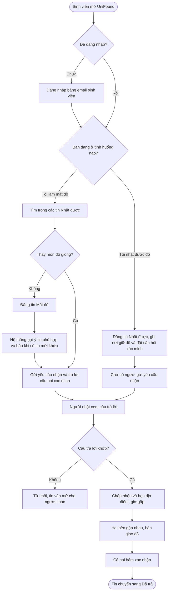

# Tổng quan dự án

**UniFound** là nền tảng web giúp sinh viên các trường ĐHQG-HCM khu vực Thủ Đức đăng tin và tìm đồ thất lạc, để người mất đồ và người nhặt được đồ gặp nhau nhanh trên một nơi duy nhất.

## 1. Problem statement

- Tin đăng nằm rải rác ở Facebook, nhóm lớp, Zalo/Discord, confession và bàn bảo vệ.
- Tin không theo mẫu chung (thiếu ảnh, thiếu địa điểm, thiếu thời gian) và trôi rất nhanh.
- Người mất và người nhặt thường đăng ở hai kênh khác nhau nên không thấy nhau.

UniFound tập trung Lost/Found Report về một nơi, gợi ý các cặp có khả năng liên quan, giúp người dùng đi từ đăng tin đến gửi claim, xác minh, hẹn bàn giao và ghi nhận đồ đã được trả lại trong một luồng rõ ràng.

## 2. Mục tiêu

1. Gom mọi tin mất/nhặt đồ về một nơi, theo một mẫu thống nhất.
2. Giúp hai bên tìm thấy nhau nhanh nhờ tìm kiếm, bộ lọc và gợi ý tin phù hợp (matching rule-based, giải thích được).
3. Trả đồ đúng chủ nhờ bước xác minh, không lộ thông tin liên hệ bừa bãi.
4. Có người quản trị để giữ nội dung sạch, không spam.
5. Xây dựng MVP web nhỏ nhưng hoàn chỉnh trong 3–4 tuần, có ít nhất một luồng end-to-end làm thay đổi trạng thái dữ liệu, hoạt động hợp lý trên desktop và mobile, có URL demo và dữ liệu mẫu.
6. Chứng minh AI được dùng có kiểm soát qua Human Decision và Verification.

**Chỉ số đánh giá thành công (đề xuất):** tỉ lệ tin được đánh dấu "Đã trả", thời gian trung bình từ lúc đăng đến lúc trả, số sinh viên hoạt động mỗi tháng.

## 3. Người dùng, vai trò và persona

**Đối tượng sử dụng:** sinh viên các trường thành viên ĐHQG-HCM tại Thủ Đức và ký túc xá ĐHQG. Quản trị viên là thành viên nhóm dự án hoặc đại diện Đoàn/Hội.

| Vai trò | Mô tả |
|---|---|
| **Khách** | Chưa đăng nhập, chỉ được xem bảng tin và tìm kiếm |
| **Sinh viên** (`USER`) | Đã đăng nhập. Cùng một tài khoản có thể là *người mất* ở tin này và *người nhặt* ở tin khác |
| **Quản trị viên** (`ADMIN`) | Kiểm duyệt nội dung, quản lý danh mục/địa điểm, khóa tài khoản, xem thống kê |

**Persona (giả định):** Minh, sinh viên thường xuyên học tại nhiều khu vực trong trường. Muốn tìm lại đồ nhanh mà không phải theo dõi nhiều nhóm mạng xã hội; khó khăn là tin bị trôi, mô tả không đồng nhất, khó biết tin nào đáng kiểm tra; cần đăng tin nhanh, gợi ý rõ và bảo vệ thông tin dùng để xác minh sở hữu.

## 4. Phạm vi

| Trong phạm vi | Ngoài phạm vi (giai đoạn sau) |
|---|---|
| Đăng tin mất/nhặt đồ kèm 1–5 ảnh | Ứng dụng di động riêng (native) |
| Tìm kiếm từ khóa, lọc, xem chi tiết | Nhắn tin trực tiếp trong app |
| Gợi ý tin phù hợp tự động (rule-based) | Nhận diện đồ vật bằng AI/computer vision qua ảnh, ML/LLM matching |
| Yêu cầu nhận đồ, xác minh (kèm ảnh minh chứng tùy chọn), hẹn bàn giao | Thưởng, thanh toán, vận chuyển đồ |
| Thông báo trong web, báo cáo vi phạm, trang quản trị, trợ giúp trong web | Thông báo qua email (thêm sau, ví dụ dịch vụ Resend) |
| Đăng nhập giới hạn theo email sinh viên hợp lệ | Liên thông với hệ thống của nhà trường, bản đồ/GPS |

**Các quyết định thiết kế chính**

- **Đăng nhập bằng email sinh viên** để chỉ sinh viên thật mới dùng được. Supabase Auth không tự giới hạn tên miền nên server kiểm tra danh sách tên miền hợp lệ sau khi đăng ký/đăng nhập.
- **Người nhặt tự đặt một câu hỏi xác minh** (ví dụ "Trong ví có thẻ gì?") và giữ kín đáp án. Chỉ người trả lời đúng mới được xét duyệt.
- **Thông tin liên hệ chỉ hiện sau khi người nhặt chấp nhận yêu cầu**, để tránh bị làm phiền hoặc mạo nhận.
- **Ảnh minh chứng khi gửi yêu cầu nhận là tùy chọn và riêng tư**: người mất đồ có thể đính kèm tối đa 3 ảnh (ảnh chụp trước đây, hóa đơn, hộp đựng…); chỉ người nhặt và chính người gửi xem được, không hiện trên bảng tin, chi tiết tin, gợi ý hay thông báo. Ảnh chỉ để người nhặt đối chiếu, không tự duyệt hay loại yêu cầu.
- **Giao diện chỉ có chế độ sáng** trong MVP (không có dark mode).
- **Kiểm duyệt sau khi đăng:** tin lên ngay, quản trị viên xử lý khi có báo cáo vi phạm.
- **Hết hạn không dùng tác vụ nền:** tin hết hạn sau 60 ngày, yêu cầu hết hạn sau 7 ngày; khi truy vấn, so `expires_at` với thời điểm hiện tại để coi là hết hạn.

## 5. User stories

| ID | Vai trò | Tôi muốn… | Để… | Ưu tiên |
|---|---|---|---|---|
| US01 | Sinh viên | đăng nhập bằng email trường | hệ thống biết tôi là sinh viên thật và tôi tự đặt lại mật khẩu được khi quên | Cao |
| US02 | Người mất đồ | đăng tin kèm ảnh, mô tả, nơi và thời điểm làm mất | mọi người dễ nhận ra món đồ của tôi | Cao |
| US03 | Người nhặt đồ | đăng tin nhặt được, ghi nơi đang giữ và đặt câu hỏi xác minh | đồ được trả đúng chủ | Cao |
| US04 | Mọi người dùng | xem bảng tin và lọc theo loại tin, danh mục, trường/khu vực, thời gian | nhanh chóng thu hẹp danh sách | Cao |
| US05 | Mọi người dùng | tìm kiếm bằng từ khóa, kể cả gõ không dấu | tìm đúng món đồ như "ví da đen", "thẻ sinh viên" dù gõ "vi da den" | Cao |
| US06 | Người mất đồ | nhận gợi ý các tin nhặt được có thể là đồ của mình | không phải tự lục từng tin | Cao |
| US07 | Người mất đồ | gửi yêu cầu nhận, trả lời câu hỏi xác minh và đính kèm ảnh minh chứng nếu có | chứng minh đó là đồ của tôi | Cao |
| US08 | Người nhặt đồ | xem câu trả lời và chấp nhận hoặc từ chối yêu cầu | tránh trả nhầm người | Cao |
| US09 | Hai bên | chọn điểm hẹn và giờ gặp (bàn bảo vệ, thư viện, căng tin…) | bàn giao an toàn, thuận tiện | Trung bình |
| US10 | Hai bên | xác nhận đã trả và đã nhận | tin được đóng đúng, tránh người khác tiếp tục hỏi | Cao |
| US11 | Sinh viên | sửa, đóng hoặc xóa tin của mình | tin luôn đúng và không còn khi đã xong | Trung bình |
| US12 | Sinh viên | nhận thông báo khi có gợi ý, yêu cầu hoặc phản hồi | không bỏ lỡ cơ hội tìm lại đồ | Trung bình |
| US13 | Sinh viên | báo cáo tin spam hoặc sai sự thật | cộng đồng sạch và đáng tin | Trung bình |
| US14 | Quản trị viên | ẩn tin và xử lý báo cáo vi phạm, khóa tài khoản | giữ nội dung an toàn | Cao |
| US15 | Quản trị viên | quản lý danh mục đồ vật và danh sách địa điểm | hệ thống luôn khớp thực tế các trường | Trung bình |
| US16 | Quản trị viên | xem thống kê số tin, tỉ lệ đã trả | đánh giá hiệu quả và báo cáo | Thấp |

## 6. Luồng người dùng chính

Luồng đi từ lúc sinh viên mở web đến khi đồ được trả, gồm cả hai tình huống: mất đồ và nhặt được đồ.

## 7. Ràng buộc Mini Project

- Ít nhất một user flow hoàn chỉnh và một xử lý dữ liệu/chuyển trạng thái.
- Không dùng đầu ra AI theo kiểu one-shot mà không review/verify.
- Có repository, README cài/chạy, live URL, Product Brief, 6–8 slides và Project Hub.
- Có 5–10 AI interactions có ý nghĩa, một đánh giá Accept/Modify/Reject, hai quyết định quan trọng được giải thích và một task so sánh bằng hai AI.
- Có test case chính và ít nhất một bug/problem đã phát hiện, sửa và xác minh.
