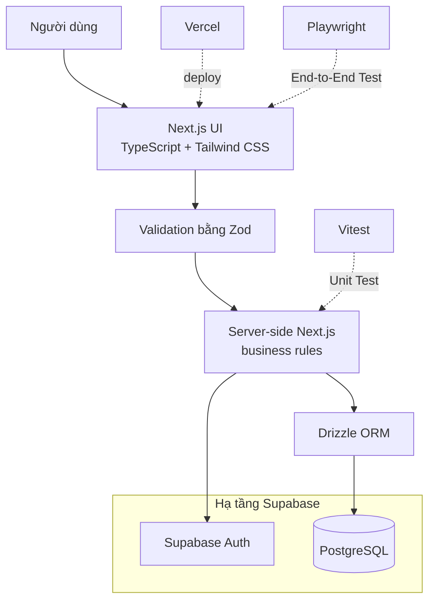

# Yêu cầu và thiết kế

> Trạng thái: **Approved specification**. Các quyết định MVP đã được chốt; chưa khẳng định đã triển khai.

## 1. Yêu cầu chức năng

| ID | Yêu cầu | User story | Ưu tiên |
|---|---|---|---|
| FR-01 | Mọi người xem và tìm/lọc các Lost/Found Report công khai. | US-01, US-02 | Must |
| FR-02 | Người dùng đã đăng nhập tạo Lost hoặc Found Report với field bắt buộc và server-side validation. | US-01, US-02 | Must |
| FR-03 | Xem chi tiết một report và trạng thái hiện tại. | US-03, US-04 | Must |
| FR-04 | Tính và hiển thị Potential Matches giữa Lost/Found Report bằng rule-based score. | US-03 | Must |
| FR-05 | Người dùng đã đăng nhập gửi claim kèm thông tin xác minh riêng tư cho Found Report không thuộc sở hữu của mình. | US-04 | Must |
| FR-06 | Claimant theo dõi claim của mình; chủ Found Report xử lý claim và đánh dấu `Returned` sau khi trao trả. | US-05 | Must |

## 2. Yêu cầu phi chức năng

- Responsive và usable trên desktop/mobile.
- Form có label, thông báo lỗi rõ và thao tác được bằng bàn phím ở mức cơ bản.
- Không lộ secret, dữ liệu cá nhân thật hoặc thông tin xác minh sở hữu không cần công khai.
- Match score có thể giải thích, nhất quán và không vượt miền giá trị đã chốt.
- Luồng demo hoạt động ổn định với dữ liệu mẫu; trình duyệt mục tiêu và ngưỡng hiệu năng là `TBD`.

## 3. Acceptance criteria mức feature

### FR-02 — Tạo report

- Given người dùng ở màn hình Create Report, when nhập đủ dữ liệu hợp lệ và submit, then report được lưu và xuất hiện với đúng loại/trạng thái.
- Given thiếu field bắt buộc, when submit, then không lưu và hiển thị lỗi tại field liên quan.

### FR-04 — Potential Matches

- Given có Lost và Found Report, when mở kết quả matching, then chỉ các cặp đủ điều kiện được hiển thị cùng score hoặc lý do khớp.
- Score phải deterministic với cùng input; dữ liệu thiếu không gây lỗi hoặc cộng điểm sai.

### FR-05/06 — Claim và Returned

- Given report phù hợp và claim hợp lệ, when gửi claim, then trạng thái được lưu và hiển thị trong My Reports.
- Chỉ actor hợp lệ mới được chuyển trạng thái; chuyển trạng thái sai bị từ chối và không làm mất dữ liệu.

## 4. Màn hình dự kiến

| ID | Màn hình | Mục đích chính |
|---|---|---|
| SCR-01 | Home / Lost & Found Feed | Xem, tìm và lọc report |
| SCR-02 | Create Report | Tạo Lost/Found Report |
| SCR-03 | Report Detail | Xem mô tả, trạng thái và gửi claim phù hợp |
| SCR-04 | Potential Matches | Xem các cặp gợi ý và score/lý do |
| SCR-05 | My Reports / Claim Status | Theo dõi và hoàn tất luồng |

Mỗi màn hình quan trọng cần có loading, empty, validation/error và layout mobile phù hợp. Feed và chi tiết report công khai; thao tác tạo/quản lý report hoặc claim yêu cầu đăng nhập.

## 5. UI/UX và asset

- Ưu tiên tạo report nhanh, nhãn Lost/Found dễ phân biệt nhưng không chỉ dựa vào màu.
- Match score phải đi kèm tín hiệu giải thích; không trình bày như xác nhận sở hữu.
- Trạng thái và hành động tiếp theo phải rõ trên detail/My Reports.
- Wireframe/mockup lưu trong `assets/ui/`; hiện chưa có.

## 6. Kiến trúc mức cao

### Use Case Diagram

Sơ đồ chỉ mô tả phạm vi MVP hiện tại. Hai actor “Sinh viên mất đồ” và “Sinh viên nhặt được đồ” là vai trò chuyên biệt của “Sinh viên”, không phải loại tài khoản riêng.

- PlantUML source: [`use_case_diagram.puml`](assets/diagrams/use_case_diagram.puml).
- Trạng thái: **Draft asset** — quyền và điều kiện xác minh đã được chốt trong DEC-002/DEC-005; sơ đồ cần được đồng bộ trong công việc cập nhật diagram riêng.

### Kiến trúc hệ thống

```text
Responsive Web UI
       ↓
Backend / validation / matching / state rules
       ↓
Data storage
```

Ứng dụng dùng Next.js + TypeScript cho UI và server/backend, Tailwind CSS cho UI, Zod cho validation, Drizzle ORM truy cập PostgreSQL trên Supabase, Supabase Auth cho xác thực và Vercel để hosting. Drizzle chỉ chạy phía server; server là nơi quyết định cuối cùng về validation và business rule. Sơ đồ nộp bài sẽ lưu tại `assets/diagrams/`.

## 7. Data model dự kiến

| Entity | Mục đích | Field/quan hệ cần nghiên cứu |
|---|---|---|
| User | Chủ report và người gửi claim | Supabase Auth identity, reports, claims |
| Report | Lost/Found item và trạng thái | owner, type, title, category, description, location, eventDate, status |
| Claim | Yêu cầu nhận lại Found item | claimant, found report, verification info riêng tư, status, created time |

Không tạo bảng Match riêng nếu score có thể tính khi đọc; chỉ lưu khi có nhu cầu lịch sử/hiệu năng được chứng minh. PostgreSQL là nguồn dữ liệu nghiệp vụ chính; `localStorage` không được dùng thay database.

## 8. Matching rule

Chỉ tính điểm giữa `Lost Report` và `Found Report`:

| Tín hiệu | Điểm |
|---|---:|
| Category giống nhau | 30 |
| Location giống nhau | 30 |
| Ngày xảy ra chênh lệch không quá 3 ngày | 20 |
| Keyword trong title/description tương đồng | 20 |
| **Tổng tối đa** | **100** |

- Chỉ hiển thị Potential Match khi `score >= 50`.
- Kết quả phải nêu các lý do được cộng điểm.
- Cùng input phải cho cùng kết quả; không dùng AI, embedding hoặc machine learning.
- Field tùy chọn bị thiếu không cộng điểm, không gây lỗi và không được tự suy đoán.
- Matching chỉ là gợi ý để kiểm tra, không phải xác nhận quyền sở hữu.

## 9. Quyết định MVP đã chốt

### DEC-001 — Quyền truy cập và đăng nhập

- Mọi người được xem report công khai.
- Chỉ người dùng đã đăng nhập được tạo report, gửi claim và quản lý report/claim của mình.
- Chủ report chỉ được sửa hoặc xóa report của mình.
- Claimant xem trạng thái claim do mình gửi; chủ Found Report xem các claim gửi đến report đó.
- Dùng Supabase Auth với email/password hoặc magic link; MVP không có Admin, Moderator hoặc Staff.
- Supabase Auth xác định danh tính; server vẫn phải kiểm tra ownership và quyền thực hiện từng thao tác.

### DEC-002 — Report, category, location và trạng thái

- Field Report bắt buộc: `type` (`Lost` hoặc `Found`), `title`, `category`, `description`, `location`, `eventDate`.
- Server từ chối request thiếu hoặc sai định dạng field bắt buộc.
- Category là danh sách cố định: Điện tử; Ví / giấy tờ; Chìa khóa; Quần áo / phụ kiện; Sách / dụng cụ học tập; Khác.
- Location là danh sách khu vực đã định nghĩa trong trường, không dùng GPS hoặc tọa độ chính xác.
- Claim có các trạng thái `Pending`, `Accepted`, `Rejected`, `Closed`.
- Một Found Report có tối đa một claim `Accepted`; khi accept một claim, các claim còn lại có thể chuyển sang `Rejected` hoặc `Closed`.
- `Accepted` nghĩa là claim được chủ Found Report chấp nhận; `Returned` chỉ được đặt sau khi món đồ thực sự được trao trả.
- Report và claim phải có cơ chế xóa hoặc đóng. Không công khai thông tin liên hệ cá nhân như field bắt buộc trên feed.

### DEC-003 — Matching

- Áp dụng rule và ngưỡng tại [mục 8](#8-matching-rule).
- Phiên bản đầu chỉ xét location giống nhau; chưa có khái niệm khu vực gần nhau.

### DEC-004 — Stack và triển khai

- Stack và ranh giới trách nhiệm được mô tả tại [mục 10](#10-technology-stack).
- PostgreSQL là nguồn dữ liệu nghiệp vụ chính. Không dùng `localStorage` hoặc file JSON để thay database; `localStorage` chỉ dành cho dữ liệu client không quan trọng nếu thật sự cần.

### DEC-005 — Claim, xác minh và quyền riêng tư

- Claim chỉ là yêu cầu nhận lại đồ, chỉ gửi đến Found Report và không phải bằng chứng sở hữu.
- Người dùng không được claim report của chính mình.
- Claimant phải cung cấp thông tin xác minh riêng tư mà chủ Found Report đối chiếu với món đồ thực tế.
- Chỉ claimant và chủ Found Report liên quan được truy cập thông tin xác minh; dữ liệu này không xuất hiện trên feed hoặc được dùng cho public matching.
- Chỉ chủ Found Report được xem thông tin xác minh, `Accept`, `Reject` claim và đánh dấu report `Returned`.
- MVP không có chat hoặc Moderator xác minh thay.
- Seed không dùng dữ liệu cá nhân hoặc thông tin xác minh nhạy cảm thật; không lưu thêm dữ liệu nhạy cảm ngoài nhu cầu MVP.

## 10. Technology Stack

### Sơ đồ tổng thể



Next.js chứa UI và phần server cần thiết trong cùng project. Zod kiểm tra dữ liệu đi vào; business rule và Authorization vẫn do server thực hiện. Drizzle là lớp truy cập PostgreSQL, còn Supabase cung cấp PostgreSQL được host và Authentication.

### Next.js

**Vai trò trong UniFound**

Next.js cung cấp giao diện web và phần server-side/backend cần thiết trong cùng một project. UniFound có thể dùng routing, server-side logic và API hoặc Server Actions tùy cách tổ chức khi triển khai.

**Vì sao chọn**

- Phù hợp với MVP nhỏ có khoảng năm màn hình và một số luồng server.
- Giảm số project, cấu hình và deployment mà nhóm phải quản lý.
- Giữ UI và server logic gần nhau trong khi vẫn tách rõ business rule phía server.

**Nếu không dùng**

Nhóm có thể tách React frontend và Node.js/Express backend thành hai ứng dụng, nhưng phải tự cấu hình giao tiếp, chạy local và deploy cho cả hai. Next.js không thay PostgreSQL, Drizzle hoặc Supabase Auth.

### TypeScript

**Vai trò trong UniFound**

TypeScript bổ sung kiểm tra kiểu dữ liệu cho JavaScript. Các kiểu như `Report`, `Claim`, `User` và `Status` giúp dữ liệu nhất quán hơn giữa UI, validation, server và database.

**Vì sao chọn**

- Phát hiện sớm lỗi truyền sai field hoặc sai kiểu dữ liệu khi phát triển theo nhóm.
- Hỗ trợ đổi cấu trúc dữ liệu có kiểm soát hơn vì nơi dùng kiểu bị ảnh hưởng có thể được tìm thấy khi build.
- Kết hợp với Zod và Drizzle để giảm chênh lệch giữa dữ liệu runtime, code và schema.

**Nếu không dùng**

JavaScript vẫn hoạt động, nhưng nhóm phải dựa nhiều hơn vào runtime validation, convention và kiểm thử để phát hiện lỗi kiểu dữ liệu.

### Tailwind CSS

**Vai trò trong UniFound**

Tailwind CSS cung cấp utility class để xây styling cho feed, form, trạng thái và responsive layout trực tiếp trong component.

**Vì sao chọn**

- Giúp tạo và chỉnh UI nhanh trong thời gian MVP ngắn.
- Dễ giữ spacing, breakpoint và style nhất quán khi nhóm thống nhất convention.
- Hạn chế phải đặt tên và quản lý nhiều CSS selector dùng riêng cho từng component.

**Nếu không dùng**

Nhóm vẫn có thể dùng CSS, CSS Modules hoặc framework CSS khác, nhưng phải tự tổ chức style và quy ước nhất quán nhiều hơn. Tailwind không thay thế kiến thức CSS.

### Zod

**Vai trò trong UniFound**

Zod là thư viện Validation, tức kiểm tra dữ liệu đầu vào; không phải database hoặc Authentication.

```text
Request / Form Data
        ↓
       Zod
        ↓
 Dữ liệu hợp lệ?
```

Trong UniFound, schema Zod có thể kiểm tra `title` không rỗng, `type` chỉ là `Lost` hoặc `Found`, `eventDate` đúng định dạng và category/location thuộc danh sách hợp lệ. Validation quan trọng phải chạy phía server, không chỉ ở frontend.

**Vì sao chọn**

- Gom rule về hình dạng và định dạng input vào schema có thể tái sử dụng.
- Trả lỗi có cấu trúc cho form và request.
- Phù hợp với TypeScript nhưng vẫn kiểm tra được dữ liệu thật tại runtime.

**Nếu không dùng**

Nhóm phải tự viết và duy trì các nhánh như “title rỗng → lỗi”, “type không hợp lệ → lỗi”, “date sai → lỗi” cho nhiều request.

Zod kiểm tra dữ liệu tại ranh giới ứng dụng và giúp trả lỗi sớm; constraint của PostgreSQL bảo vệ tính toàn vẹn khi dữ liệu được ghi. Hai lớp bổ sung cho nhau, không thay thế nhau.

### PostgreSQL

**Vai trò trong UniFound**

PostgreSQL là hệ quản trị cơ sở dữ liệu quan hệ và là nguồn dữ liệu nghiệp vụ chính. Nó lưu dữ liệu ứng dụng liên quan đến User/profile, Report, Claim, Category, Location, trạng thái và các quan hệ cần thiết.

```text
User   1 ── N Report
User   1 ── N Claim
Report 1 ── N Claim
```

**Vì sao chọn**

- Mô hình quan hệ phù hợp trực tiếp với ownership và luồng claim của UniFound.
- Primary Key, Foreign Key, `UNIQUE`, `NOT NULL` và `CHECK` giúp bảo vệ tính hợp lệ của dữ liệu.
- `JOIN` hỗ trợ lấy report cùng owner/claim; Transaction giữ nhiều thay đổi trạng thái nhất quán.
- Referential integrity ngăn quan hệ mồ côi hoặc tham chiếu không hợp lệ.

**Nếu không dùng**

Nhóm phải chọn database khác hoặc tự quản lý cách lưu, truy vấn, quan hệ và tính toàn vẹn dữ liệu.

`localStorage` chỉ là kho key-value trong từng browser: không tự hiểu PK/FK, quan hệ bảng, `JOIN`, Transaction hoặc constraint, và không phải nguồn dữ liệu dùng chung giữa nhiều người dùng. Dùng nó thay database buộc nhóm tự viết nhiều rule bằng JavaScript nhưng dữ liệu vẫn chủ yếu nằm riêng trên từng browser. Mock data là dữ liệu giả phục vụ phát triển/demo; nó không đồng nghĩa với `localStorage`.

### Supabase

**Vai trò trong UniFound**

Supabase cung cấp PostgreSQL được host, Supabase Auth và hạ tầng hỗ trợ cần thiết. PostgreSQL vẫn là database cốt lõi; Supabase không phải ORM và không thay business logic phía server.

**Vì sao chọn**

- Nhóm không phải tự vận hành máy chủ PostgreSQL cho MVP.
- Database và Authentication có thể dùng trong cùng một hạ tầng quản lý.
- Phù hợp với nhu cầu demo có dữ liệu dùng chung và tài khoản thật của ứng dụng.

**Nếu không dùng**

Nhóm phải chọn dịch vụ PostgreSQL/Auth khác hoặc tự host và vận hành các phần tương ứng.

### Drizzle ORM

**Vai trò trong UniFound**

ORM (Object-Relational Mapping) là lớp giúp code TypeScript làm việc với dữ liệu quan hệ. Drizzle chỉ được dùng ở server-side để định nghĩa schema bằng code, tạo Migration, viết query type-safe và giảm map thủ công giữa kết quả SQL với TypeScript.

```text
Server-side TypeScript
        ↓
   Drizzle ORM
        ↓
    PostgreSQL
```

Migration là thay đổi có phiên bản dùng để đưa schema database từ trạng thái này sang trạng thái khác.

**Vì sao chọn**

- Schema và query có type checking cùng code TypeScript.
- Theo dõi thay đổi schema bằng Migration thay vì sửa database thủ công không có lịch sử.
- Giảm lỗi do tên cột hoặc kiểu dữ liệu giữa code và SQL không khớp.

**Nếu không dùng**

Nhóm vẫn có thể dùng PostgreSQL driver và viết trực tiếp `SELECT`, `INSERT`, `UPDATE`, `DELETE`; đây là cách hợp lệ nhưng cần tự quản lý SQL, Migration và mapping dữ liệu nhiều hơn. Drizzle là lớp làm việc với PostgreSQL, không phải database.

### Supabase Auth

**Vai trò trong UniFound**

Supabase Auth xử lý Authentication (xác thực người dùng là ai): đăng ký, đăng nhập, đăng xuất, session và xác định user hiện tại.

```text
Authentication = Người dùng là ai?
Authorization  = Người đó được phép làm gì?
```

Authorization (phân quyền thao tác) vẫn do server UniFound kiểm tra: chỉ owner của Found Report được Accept Claim, người dùng không được sửa report của người khác và không được claim report của chính mình.

**Vì sao chọn**

- Cung cấp luồng tài khoản và session cần thiết mà MVP không phải tự xây từ đầu.
- Tích hợp phù hợp với PostgreSQL/Supabase đã chọn.
- Cho server một danh tính đã xác thực để áp dụng ownership và business rule.

**Nếu không dùng**

Nhóm phải tự xây hoặc chọn dịch vụ khác cho lưu tài khoản, password hashing, login, session/token, logout, reset password hoặc flow tương đương và bảo vệ endpoint. Supabase Auth không tự quyết định Authorization nghiệp vụ.

### Vercel

**Vai trò trong UniFound**

Vercel là target deploy cho ứng dụng Next.js và cung cấp URL demo.

**Vì sao chọn**

- Giảm cấu hình cần thiết để build và deploy một project Next.js.
- Phù hợp với workflow cập nhật nhanh của MVP và nhu cầu có URL trình diễn.

**Nếu không dùng**

Nhóm phải chọn nền tảng hosting khác và tự cấu hình build, environment variables, runtime và domain/URL tương ứng.

### Vitest

**Vai trò trong UniFound**

Vitest là test runner dùng cho Unit Test, tức kiểm thử function hoặc module nhỏ và độc lập. Phạm vi chính là matching score, validation helper, state transition và business rule deterministic.

```text
Cùng category       → +30
Cùng location       → +30
Ngày chênh lệch ≤ 3 → +20
```

**Vì sao chọn**

- Cho phản hồi nhanh khi kiểm tra logic thuần TypeScript.
- Phù hợp với các rule có input/output rõ và cần kết quả lặp lại được.
- Giúp phát hiện regression mà không cần chạy toàn bộ trình duyệt.

**Nếu không dùng**

Nhóm phải dùng test runner khác hoặc kiểm tra thủ công, dễ bỏ sót regression ở logic nhỏ.

### Playwright

**Vai trò trong UniFound**

Playwright dùng cho End-to-End Test, tức kiểm thử luồng người dùng trên ứng dụng hoàn chỉnh qua trình duyệt.

```text
Login
→ Create Found Report
→ User khác gửi Claim
→ Owner xem Claim
→ Accept Claim
→ Mark Returned
```

**Vì sao chọn**

- Kiểm tra các phần UI, server, Authentication và database có phối hợp đúng trong luồng thật.
- Phù hợp để xác minh user flow cốt lõi trước demo/deploy.
- Bắt lỗi routing, form và quyền truy cập mà Unit Test riêng lẻ không thấy.

**Nếu không dùng**

Nhóm phải kiểm thử thủ công toàn bộ luồng hoặc dùng framework E2E khác.

```text
Vitest    → test function/module nhỏ
Playwright → test luồng người dùng trên ứng dụng hoàn chỉnh
```

### So sánh nhanh

| Công nghệ | Vai trò | Nếu không dùng |
|---|---|---|
| Zod | Validation | Tự viết validation |
| Drizzle ORM | Truy cập PostgreSQL | Viết SQL/driver trực tiếp |
| Supabase Auth | Authentication | Tự xây hoặc chọn dịch vụ auth/session khác |
| PostgreSQL | Lưu dữ liệu quan hệ | Dùng database khác hoặc tự quản lý dữ liệu |
| Tailwind CSS | Styling UI | Dùng CSS/CSS Modules/framework khác |
| Vitest | Unit Test | Dùng test runner khác hoặc thiếu automated Unit Test |
| Playwright | End-to-End Test | Test thủ công hoặc dùng framework E2E khác |

## 11. Chi tiết cần đặc tả trước khi triển khai

Các quyết định trên không tự mở rộng để lấp các chi tiết chưa được cung cấp:

- Danh sách location đầy đủ của trường.
- Quy tắc chuẩn hóa/so sánh keyword và test dataset dùng để kiểm chứng DEC-003.
- Cơ chế cụ thể cho thao tác xóa/đóng report và claim.
