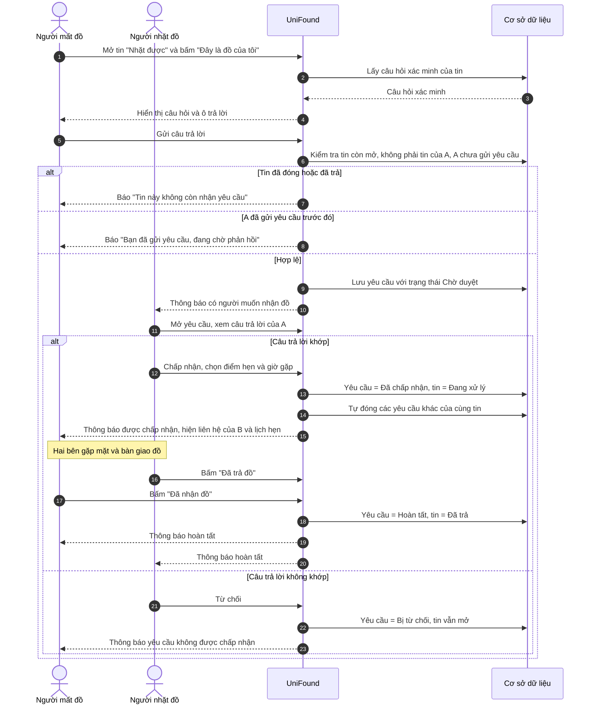
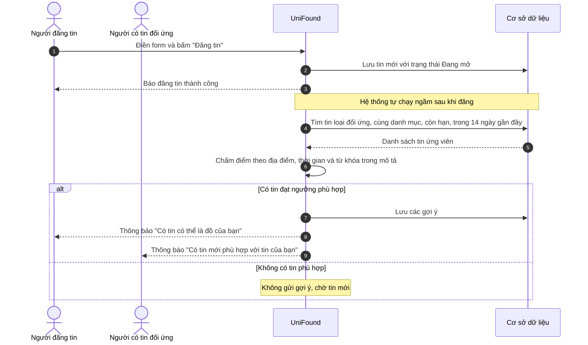

# Yêu cầu và thiết kế

User story và vai trò xem ở [01_overview.md](01_overview.md#5-user-stories).

## 1. Vai trò và quyền truy cập

| Vai trò | Quyền chính |
|---|---|
| Khách | Xem bảng tin, tìm kiếm, xem chi tiết tin công khai |
| Sinh viên (`USER`) | Mọi quyền của Khách; đăng tin, gửi/xử lý yêu cầu nhận đồ, quản lý tin của mình, nhận thông báo, báo cáo vi phạm |
| Quản trị viên (`ADMIN`) | Mọi quyền của Sinh viên; ẩn tin, xử lý báo cáo vi phạm, khóa/mở khóa tài khoản, quản lý danh mục/địa điểm, xem thống kê |

Supabase Auth xác định danh tính; server vẫn phải kiểm tra ownership và quyền thực hiện từng thao tác. `USER` là mặc định khi đăng ký và không tự nâng quyền; `ADMIN` là tài khoản được cấp sẵn. Không có Moderator hoặc Staff.

## 2. Yêu cầu chức năng

| ID | Nhóm | Yêu cầu | Story |
|---|---|---|---|
| FR01 | Tài khoản | Đăng nhập/đăng ký bằng email sinh viên do trường cấp; server từ chối email có tên miền ngoài danh sách trường hợp lệ | US01 |
| FR02 | Tài khoản | Người dùng cập nhật họ tên, MSSV, trường và thông tin liên hệ (Zalo/SĐT) | US01 |
| FR03 | Tin đăng | Tạo tin loại **Mất đồ** (`LOST`) hoặc **Nhặt được** (`FOUND`) với: tiêu đề, danh mục, mô tả, ngày giờ, địa điểm, 1–5 ảnh; validation phía server | US02, US03 |
| FR04 | Tin đăng | Tin **Nhặt được** có thêm: nơi đang giữ đồ, câu hỏi xác minh và đáp án (đáp án không hiển thị công khai) | US03 |
| FR05 | Tin đăng | Chủ tin được sửa, đóng hoặc xóa tin; tin tự hết hạn sau 60 ngày | US11 |
| FR06 | Tìm kiếm | Bảng tin có phân trang; lọc theo loại tin, danh mục, trường/khu vực, khoảng thời gian | US04 |
| FR07 | Tìm kiếm | Tìm theo từ khóa trong tiêu đề và mô tả | US05 |
| FR08 | Gợi ý | Khi có tin mới, hệ thống tìm tin đối ứng (Mất ↔ Nhặt) còn hạn, gần thời gian và địa điểm, chấm điểm và gợi ý cho cả hai bên | US06 |
| FR09 | Nhận đồ | Người mất gửi yêu cầu nhận vào tin Nhặt được, kèm câu trả lời xác minh; mỗi người chỉ gửi một yêu cầu cho mỗi tin | US07 |
| FR10 | Nhận đồ | Người nhặt xem yêu cầu, chấp nhận hoặc từ chối; khi chấp nhận, các yêu cầu còn lại tự động bị đóng | US08 |
| FR11 | Bàn giao | Sau khi chấp nhận, hai bên thấy thông tin liên hệ của nhau; người nhặt đề xuất điểm và giờ hẹn | US09 |
| FR12 | Bàn giao | Cả hai bên bấm xác nhận thì tin chuyển sang **Đã trả** | US10 |
| FR13 | Thông báo | Gửi thông báo trong web khi có gợi ý mới, yêu cầu mới, kết quả duyệt, lịch hẹn. Thông báo email để giai đoạn sau | US12 |
| FR14 | Kiểm duyệt | Người dùng báo cáo tin kèm lý do; quản trị viên xem, ẩn tin hoặc bỏ qua | US13, US14 |
| FR15 | Quản trị | Khóa/mở khóa tài khoản; quản lý danh mục và địa điểm | US14, US15 |
| FR16 | Quản trị | Bảng thống kê: số tin theo tuần, tỉ lệ đã trả, danh mục phổ biến | US16 |

**Quy tắc nghiệp vụ**

- Thông tin liên hệ chỉ hiện sau khi người nhặt chấp nhận yêu cầu.
- Không được gửi yêu cầu nhận vào tin của chính mình.
- Tin ở trạng thái `RETURNED` hoặc `CLOSED` không nhận thêm yêu cầu.
- Một tin Nhặt được có tối đa một yêu cầu `ACCEPTED`.
- Tin hết hạn sau 60 ngày và yêu cầu không được phản hồi sau 7 ngày được coi là hết hạn. Không có tác vụ nền: khi truy vấn, so `expires_at` với thời điểm hiện tại.
- Đáp án xác minh và thông tin liên hệ không xuất hiện trên feed hoặc dùng cho public matching.

**Acceptance criteria**

- **FR03 — Tạo tin:**
  - Given người dùng ở màn hình Đăng tin, when nhập đủ dữ liệu hợp lệ và submit, then tin được lưu và xuất hiện với đúng loại/trạng thái.
  - Given thiếu field bắt buộc hoặc ảnh ngoài 1–5, when submit, then không lưu và hiển thị lỗi tại field liên quan.
- **FR01 — Email sinh viên:**
  - Given email có tên miền không thuộc danh sách hợp lệ, when đăng ký/đăng nhập, then server từ chối và hiển thị thông báo lỗi.
- **FR08 — Gợi ý:**
  - Given có tin Mất và tin Nhặt, when có tin mới được đăng, then chỉ các cặp đủ điều kiện được lưu và hiển thị cùng score/lý do khớp.
  - Score phải deterministic với cùng input; dữ liệu thiếu không gây lỗi hoặc cộng điểm sai.
- **FR09/10/12 — Yêu cầu nhận đồ và Đã trả:**
  - Given tin còn mở và yêu cầu hợp lệ, when gửi yêu cầu, then trạng thái được lưu và hiển thị trong Tin của tôi.
  - Chỉ actor hợp lệ mới được chuyển trạng thái; chuyển trạng thái sai bị từ chối và không làm mất dữ liệu.
- **FR05/FR14 — Sửa/xóa/ẩn tin:**
  - Given người dùng là chủ tin hoặc `ADMIN`, when sửa/xóa/ẩn tin, then thay đổi được lưu.
  - Given người dùng `USER` không phải chủ tin, when cố sửa hoặc xóa, then server từ chối (403) và dữ liệu không đổi.

## 3. Yêu cầu phi chức năng

- Dùng tốt trên điện thoại (responsive desktop/mobile); giao diện hoàn toàn bằng tiếng Việt.
- Trang bảng tin tải dưới 3 giây.
- Chỉ lưu thông tin cá nhân cần thiết; ảnh giới hạn số lượng (1–5) và dung lượng.
- Form có label, thông báo lỗi rõ và thao tác được bằng bàn phím ở mức cơ bản.
- Không lộ secret, dữ liệu cá nhân thật hoặc thông tin xác minh sở hữu không cần công khai.
- Match score có thể giải thích, nhất quán và không vượt miền giá trị đã chốt.
- Trình duyệt mục tiêu và các ngưỡng hiệu năng khác là `TBD`.

## 4. UI/UX

- Ưu tiên tạo tin nhanh, nhãn Mất đồ/Nhặt được dễ phân biệt nhưng không chỉ dựa vào màu.
- Match score đi kèm tín hiệu giải thích; không trình bày như xác nhận sở hữu.
- Trạng thái và hành động tiếp theo phải rõ trên Chi tiết tin và Tin của tôi.
- Mỗi màn hình quan trọng cần có loading, empty, validation/error và layout mobile phù hợp.

## 5. Sơ đồ Use Case

*Include* nghĩa là bước luôn đi kèm; *extend* nghĩa là bước phát sinh thêm tùy tình huống. Sinh viên kế thừa các thao tác của Khách. Quản trị viên (`ADMIN`) là người dùng có quyền kiểm duyệt và quản trị.

- PlantUML source: [`use_case_diagram.puml`](assets/use_case_diagram.puml).

## 6. Luồng người dùng chính

Xem sơ đồ luồng từ lúc mở web đến khi tin chuyển sang Đã trả tại [01_overview.md](01_overview.md#6-luồng-người-dùng-chính).

## 7. Các màn hình dự kiến

| ID | Màn hình | Ai dùng | Nội dung chính |
|---|---|---|---|
| S01 | Bảng tin (trang chủ) | Mọi người | Hai tab *Mất đồ / Nhặt được*, ô tìm kiếm, bộ lọc, danh sách thẻ tin (ảnh, tiêu đề, địa điểm, thời gian), nút "Đăng tin" |
| S02 | Đăng nhập | Khách | Đăng nhập bằng email sinh viên, thông báo lỗi nếu email không hợp lệ |
| S03 | Đăng tin | Sinh viên | Chọn loại tin, form nhập thông tin, tải ảnh; tin Nhặt được có thêm ô "Nơi đang giữ" và "Câu hỏi xác minh" |
| S04 | Chi tiết tin | Mọi người | Ảnh, mô tả, địa điểm, thời gian, trạng thái; nút "Đây là đồ của tôi" (tin Nhặt được) hoặc "Tôi đã thấy đồ này" (tin Mất đồ); nút báo cáo vi phạm; chủ tin/`ADMIN` sửa/xóa |
| S05 | Gửi yêu cầu nhận đồ | Sinh viên | Hiển thị câu hỏi xác minh, ô trả lời, ô mô tả thêm, nút gửi |
| S06 | Gợi ý phù hợp | Sinh viên | Danh sách tin có khả năng khớp kèm mức độ phù hợp, nút "Không phải" hoặc "Xem chi tiết" |
| S07 | Tin của tôi | Sinh viên | Ba tab: tin đã đăng, yêu cầu tôi đã gửi, yêu cầu tôi nhận được; sửa/đóng tin |
| S08 | Xử lý yêu cầu & bàn giao | Sinh viên | Xem câu trả lời, nút Chấp nhận/Từ chối, chọn điểm hẹn và giờ, thông tin liên hệ (sau khi chấp nhận), nút xác nhận đã trả/đã nhận |
| S09 | Thông báo | Sinh viên | Danh sách thông báo, đánh dấu đã đọc |
| S10 | Hồ sơ cá nhân | Sinh viên | Họ tên, MSSV, trường, thông tin liên hệ |
| S11 | Quản trị: Tổng quan | Quản trị viên | Thống kê số tin, tỉ lệ đã trả, biểu đồ theo tuần |
| S12 | Quản trị: Kiểm duyệt | Quản trị viên | Danh sách báo cáo vi phạm, xem tin, ẩn hoặc bỏ qua, khóa tài khoản |
| S13 | Quản trị: Danh mục & địa điểm | Quản trị viên | Thêm, sửa, ẩn danh mục đồ vật và địa điểm |

Feed và chi tiết tin công khai; thao tác tạo/quản lý tin hoặc yêu cầu cần đăng nhập.

## 8. Kiến trúc mức cao

```text
Responsive Web UI
       ↓
Backend / validation / matching / state rules
       ↓
Data storage (PostgreSQL) + File storage (ảnh)
```

Ứng dụng dùng Next.js + TypeScript cho UI và server/backend, Tailwind CSS cho UI, Zod cho validation, Drizzle ORM truy cập PostgreSQL trên Supabase, Supabase Auth cho xác thực, Supabase Storage cho ảnh và Vercel để hosting. Drizzle chỉ chạy phía server; server là nơi quyết định cuối cùng về validation và business rule.

Các quyết định kiến trúc bổ sung để đáp ứng thiết kế:

| Nhu cầu | Giải pháp |
|---|---|
| Đăng 1–5 ảnh mỗi tin | Supabase Storage (cùng nền tảng, không thêm dịch vụ); bảng `report_images` lưu đường dẫn |
| Chỉ email trường mới đăng nhập được | Server kiểm tra tên miền email với danh sách hợp lệ sau khi đăng ký/đăng nhập |
| Thông báo | MVP chỉ thông báo trong web (bảng `notifications`). Email để sau (ví dụ Resend) |
| Tin hết hạn 60 ngày, yêu cầu hết hạn 7 ngày | Không cần tác vụ nền; truy vấn coi bản ghi quá `expires_at` là hết hạn |
| Tìm kiếm từ khóa | Full-text search có sẵn của PostgreSQL, không thêm công cụ |

Sơ đồ, lý do chọn và phương án thay thế của từng công nghệ nằm ở [03_development.md](03_development.md#1-technology-stack).

## 9. Mô hình dữ liệu (ERD)

Mỗi khối là một bảng dữ liệu hệ thống lưu; đường nối cho biết quan hệ giữa các bảng. Quy trình tạo schema bằng Drizzle xem [03_development.md](03_development.md#6-database-workflow).

```mermaid
erDiagram
    SCHOOLS ||--o{ USERS : "có sinh viên"
    SCHOOLS ||--o{ LOCATIONS : "có địa điểm"
    USERS ||--o{ REPORTS : "đăng"
    CATEGORIES ||--o{ REPORTS : "phân loại"
    LOCATIONS ||--o{ REPORTS : "xảy ra tại"
    REPORTS ||--o{ REPORT_IMAGES : "có ảnh"
    REPORTS ||--o{ MATCHES : "là tin mất"
    REPORTS ||--o{ MATCHES : "là tin nhặt"
    REPORTS ||--o{ CLAIMS : "nhận yêu cầu"
    USERS ||--o{ CLAIMS : "gửi yêu cầu"
    LOCATIONS ||--o{ CLAIMS : "điểm hẹn"
    USERS ||--o{ NOTIFICATIONS : "nhận"
    REPORTS ||--o{ FLAGS : "bị báo cáo"
    USERS ||--o{ FLAGS : "báo cáo"

    SCHOOLS {
        int id PK
        string name "Tên trường"
        string code "Mã trường"
    }
    USERS {
        int id PK
        int school_id FK
        string email UK "Email sinh viên"
        string full_name "Họ tên"
        string student_code "MSSV"
        string contact_info "Zalo hoặc SĐT, chỉ lộ sau khi được chấp nhận"
        string role "USER hoặc ADMIN"
        string status "active hoặc locked"
        datetime created_at
    }
    CATEGORIES {
        int id PK
        string name "Ví, thẻ, điện thoại, chìa khóa..."
    }
    LOCATIONS {
        int id PK
        int school_id FK "Để trống nếu dùng chung, ví dụ KTX"
        string name "Tên địa điểm"
        string type "Phòng học, thư viện, căng tin, KTX, điểm bảo vệ"
    }
    REPORTS {
        int id PK
        int user_id FK
        int category_id FK
        int location_id FK
        string type "LOST hoặc FOUND"
        string title
        text description
        datetime event_time "Thời điểm mất hoặc nhặt"
        string keeping_place "Nơi đang giữ đồ, chỉ tin FOUND"
        string verify_question "Câu hỏi xác minh, chỉ tin FOUND"
        string verify_answer "Đáp án, không hiển thị công khai"
        string status "OPEN, IN_PROGRESS, RETURNED, CLOSED, HIDDEN"
        datetime created_at
        datetime expires_at "Tự hết hạn sau 60 ngày"
    }
    REPORT_IMAGES {
        int id PK
        int report_id FK
        string image_url
    }
    MATCHES {
        int id PK
        int lost_report_id FK
        int found_report_id FK
        int score "Điểm phù hợp 0-100"
        string status "SUGGESTED, DISMISSED, USED"
        datetime created_at
    }
    CLAIMS {
        int id PK
        int report_id FK "Tin Nhặt được được yêu cầu"
        int claimant_id FK "Người gửi yêu cầu"
        text answer_text "Câu trả lời xác minh"
        string status "PENDING, ACCEPTED, REJECTED, COMPLETED, EXPIRED"
        int meet_location_id FK "Điểm hẹn"
        datetime meet_time "Giờ hẹn"
        datetime finder_confirmed_at
        datetime owner_confirmed_at
        datetime created_at
    }
    NOTIFICATIONS {
        int id PK
        int user_id FK
        string type "Gợi ý, yêu cầu mới, kết quả duyệt, lịch hẹn"
        string message
        boolean is_read
        datetime created_at
    }
    FLAGS {
        int id PK
        int report_id FK
        int reporter_id FK
        string reason
        string status "NEW hoặc HANDLED"
        datetime created_at
    }
```



**Ghi chú về dữ liệu**

- **Category/Location** do quản trị viên quản lý (FR15); Location không dùng GPS hoặc tọa độ chính xác.
- **Claim** chỉ là yêu cầu nhận lại đồ gửi đến tin Nhặt được, không phải bằng chứng sở hữu. Chỉ claimant và chủ tin Nhặt được liên quan truy cập câu trả lời xác minh. Một tin có tối đa một claim `ACCEPTED`; khi chấp nhận, các claim còn lại bị đóng. `COMPLETED` khi cả `finder_confirmed_at` và `owner_confirmed_at` có giá trị, đồng thời tin chuyển `RETURNED`.
- **Match** lưu để gửi gợi ý/thông báo cho cả hai bên và ghi nhận người dùng bấm "Không phải" (`DISMISSED`); score vẫn tính bằng rule deterministic ở mục 11.
- Không công khai thông tin liên hệ cá nhân trên feed; seed không dùng dữ liệu cá nhân hoặc thông tin xác minh thật.

## 10. Sequence diagram cho các use case phức tạp

**(a) Yêu cầu nhận lại đồ, xác minh và bàn giao.** Luồng phức tạp nhất vì có kiểm tra điều kiện, hai người tham gia và nhiều trạng thái.



**(b) Tự động gợi ý tin phù hợp sau khi đăng tin.** Điểm khác biệt của UniFound so với việc đăng trên mạng xã hội.



## 11. Matching rule

Ngay sau khi lưu tin, hệ thống chạy hai bước.

**Bước 1: Lọc.** Chỉ lấy tin thỏa cả bốn điều kiện:

- Loại đối ứng (`LOST` ↔ `FOUND`).
- Cùng danh mục.
- Còn ở trạng thái Đang mở (`OPEN`).
- Đăng trong 14 ngày gần đây.

**Bước 2: Chấm điểm** từng tin còn lại:

| Tiêu chí | Điểm |
|---|---:|
| Cùng địa điểm | +40 |
| Cùng trường/khu vực (chỉ xét khi khác địa điểm) | +15 |
| Thời gian xảy ra cách nhau ≤ 1 ngày / ≤ 3 ngày / còn lại | +25 / +15 / +5 |
| Từ khóa trùng trong tiêu đề và mô tả (màu sắc, hãng, đặc điểm…) | tối đa +20 |

Tin đạt từ 50 điểm (`score >= 50`) thì được lưu vào bảng `MATCHES` (trạng thái `SUGGESTED`) và gửi thông báo cho cả hai bên. Các trọng số này chỉ là điểm khởi đầu, nhóm chạy thử với vài tin mẫu rồi chỉnh cho hợp lý.

**Thời điểm chạy.** Với quy mô sinh viên Thủ Đức, chạy ngay trong lúc lưu tin là đủ nhanh; chưa cần hàng đợi hay tác vụ nền phức tạp.

**Người dùng chưa tìm ra đồ.** Khi có tin mới, hệ thống chạy lại bước 1–2 cho tin đó, nên tin cũ vẫn được gợi ý khi có tin khớp xuất hiện sau.

**Gợi ý sai.** Nút "Không phải" ở màn hình S06 đổi trạng thái match thành `DISMISSED` để không gợi ý lại.

**Nguyên tắc chung**

- Kết quả phải nêu các lý do được cộng điểm.
- Cùng input phải cho cùng kết quả; không dùng AI, embedding hoặc machine learning.
- Field tùy chọn bị thiếu không cộng điểm, không gây lỗi và không được tự suy đoán.
- Matching chỉ là gợi ý để kiểm tra, không phải xác nhận quyền sở hữu.
