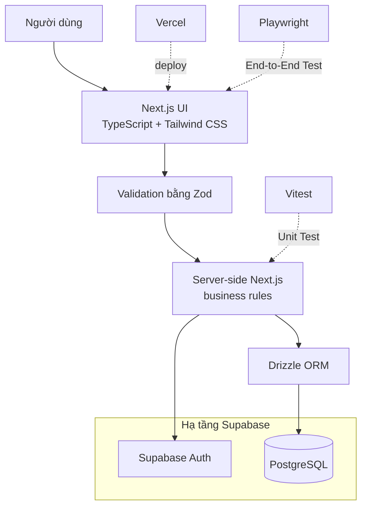

# Phát triển

## 1. Technology Stack

| Thành phần | Công nghệ |
|---|---|
| Frontend | Next.js, TypeScript, Tailwind CSS |
| Backend | Next.js server, Zod, Drizzle ORM, postgres, @supabase/ssr |
| Data storage/Auth | PostgreSQL + Supabase, Supabase Auth |
| Testing | Vitest, Playwright |
| Deployment | Vercel |

### Sơ đồ tổng thể



Next.js chứa UI và phần server cần thiết trong cùng project. Zod kiểm tra dữ liệu đi vào; business rule và Authorization vẫn do server thực hiện. Drizzle là lớp truy cập PostgreSQL, còn Supabase cung cấp PostgreSQL được host và Authentication.

### Next.js

**Vai trò trong UniFound:** cung cấp giao diện web và phần server-side/backend cần thiết trong cùng một project; có thể dùng routing, server-side logic và API hoặc Server Actions tùy cách tổ chức khi triển khai.

**Vì sao chọn**

- Phù hợp với MVP nhỏ có khoảng năm màn hình và một số luồng server.
- Giảm số project, cấu hình và deployment mà nhóm phải quản lý.
- Giữ UI và server logic gần nhau trong khi vẫn tách rõ business rule phía server.

**Nếu không dùng:** nhóm có thể tách React frontend và Node.js/Express backend thành hai ứng dụng, nhưng phải tự cấu hình giao tiếp, chạy local và deploy cho cả hai. Next.js không thay PostgreSQL, Drizzle hoặc Supabase Auth.

### TypeScript

**Vai trò trong UniFound:** bổ sung kiểm tra kiểu dữ liệu cho JavaScript. Các kiểu như `Report`, `Claim`, `User` và `Status` giúp dữ liệu nhất quán hơn giữa UI, validation, server và database.

**Vì sao chọn**

- Phát hiện sớm lỗi truyền sai field hoặc sai kiểu dữ liệu khi phát triển theo nhóm.
- Hỗ trợ đổi cấu trúc dữ liệu có kiểm soát hơn vì nơi dùng kiểu bị ảnh hưởng có thể được tìm thấy khi build.
- Kết hợp với Zod và Drizzle để giảm chênh lệch giữa dữ liệu runtime, code và schema.

**Nếu không dùng:** JavaScript vẫn hoạt động, nhưng nhóm phải dựa nhiều hơn vào runtime validation, convention và kiểm thử để phát hiện lỗi kiểu dữ liệu.

### Tailwind CSS

**Vai trò trong UniFound:** cung cấp utility class để xây styling cho feed, form, trạng thái và responsive layout trực tiếp trong component.

**Vì sao chọn**

- Giúp tạo và chỉnh UI nhanh trong thời gian MVP ngắn.
- Dễ giữ spacing, breakpoint và style nhất quán khi nhóm thống nhất convention.
- Hạn chế phải đặt tên và quản lý nhiều CSS selector dùng riêng cho từng component.

**Nếu không dùng:** nhóm vẫn có thể dùng CSS, CSS Modules hoặc framework CSS khác, nhưng phải tự tổ chức style và quy ước nhất quán nhiều hơn. Tailwind không thay thế kiến thức CSS.

### Zod

**Vai trò trong UniFound:** thư viện Validation, tức kiểm tra dữ liệu đầu vào; không phải database hoặc Authentication. Schema Zod có thể kiểm tra `title` không rỗng, `type` chỉ là `Lost` hoặc `Found`, `eventDate` đúng định dạng và category/location thuộc danh sách hợp lệ (danh sách cố định xem [02_requirements_design.md](02_requirements_design.md#6-data-model-dự-kiến)). Validation quan trọng phải chạy phía server, không chỉ ở frontend.

**Vì sao chọn**

- Gom rule về hình dạng và định dạng input vào schema có thể tái sử dụng.
- Trả lỗi có cấu trúc cho form và request.
- Phù hợp với TypeScript nhưng vẫn kiểm tra được dữ liệu thật tại runtime.

**Nếu không dùng:** nhóm phải tự viết và duy trì các nhánh như “title rỗng → lỗi”, “type không hợp lệ → lỗi”, “date sai → lỗi” cho nhiều request.

Zod kiểm tra dữ liệu tại ranh giới ứng dụng và giúp trả lỗi sớm; constraint của PostgreSQL bảo vệ tính toàn vẹn khi dữ liệu được ghi. Hai lớp bổ sung cho nhau, không thay thế nhau.

### PostgreSQL

**Vai trò trong UniFound:** hệ quản trị cơ sở dữ liệu quan hệ và là nguồn dữ liệu nghiệp vụ chính, lưu User/profile, Report, Claim, Category, Location, trạng thái và các quan hệ cần thiết.

```text
User   1 ── N Report
User   1 ── N Claim
Report 1 ── N Claim
```

**Vì sao chọn**

- Mô hình quan hệ phù hợp trực tiếp với ownership và luồng claim của UniFound.
- Primary Key, Foreign Key, `UNIQUE`, `NOT NULL` và `CHECK` giúp bảo vệ tính hợp lệ của dữ liệu.
- `JOIN` hỗ trợ lấy report cùng owner/claim; Transaction giữ nhiều thay đổi trạng thái nhất quán.
- Referential integrity ngăn quan hệ mồ côi hoặc tham chiếu không hợp lệ.

**Nếu không dùng:** nhóm phải chọn database khác hoặc tự quản lý cách lưu, truy vấn, quan hệ và tính toàn vẹn dữ liệu.

`localStorage` chỉ là kho key-value trong từng browser: không tự hiểu PK/FK, quan hệ bảng, `JOIN`, Transaction hoặc constraint, và không phải nguồn dữ liệu dùng chung giữa nhiều người dùng. Dùng nó thay database buộc nhóm tự viết nhiều rule bằng JavaScript nhưng dữ liệu vẫn chủ yếu nằm riêng trên từng browser. Mock data là dữ liệu giả phục vụ phát triển/demo; nó không đồng nghĩa với `localStorage`.

### Supabase

**Vai trò trong UniFound:** cung cấp PostgreSQL được host, Supabase Auth và hạ tầng hỗ trợ cần thiết. PostgreSQL vẫn là database cốt lõi; Supabase không phải ORM và không thay business logic phía server.

**Vì sao chọn**

- Nhóm không phải tự vận hành máy chủ PostgreSQL cho MVP.
- Database và Authentication có thể dùng trong cùng một hạ tầng quản lý.
- Phù hợp với nhu cầu demo có dữ liệu dùng chung và tài khoản thật của ứng dụng.

**Nếu không dùng:** nhóm phải chọn dịch vụ PostgreSQL/Auth khác hoặc tự host và vận hành các phần tương ứng.

### Drizzle ORM

**Vai trò trong UniFound:** ORM (Object-Relational Mapping) là lớp giúp code TypeScript làm việc với dữ liệu quan hệ. Drizzle chỉ được dùng ở server-side để định nghĩa schema bằng code, tạo Migration, viết query type-safe và giảm map thủ công giữa kết quả SQL với TypeScript. Migration là thay đổi có phiên bản dùng để đưa schema database từ trạng thái này sang trạng thái khác (quy trình thực tế ở mục 6).

**Vì sao chọn**

- Schema và query có type checking cùng code TypeScript.
- Theo dõi thay đổi schema bằng Migration thay vì sửa database thủ công không có lịch sử.
- Giảm lỗi do tên cột hoặc kiểu dữ liệu giữa code và SQL không khớp.

**Nếu không dùng:** nhóm vẫn có thể dùng PostgreSQL driver và viết trực tiếp `SELECT`, `INSERT`, `UPDATE`, `DELETE`; đây là cách hợp lệ nhưng cần tự quản lý SQL, Migration và mapping dữ liệu nhiều hơn. Drizzle là lớp làm việc với PostgreSQL, không phải database.

### Supabase Auth

**Vai trò trong UniFound:** xử lý Authentication (xác thực người dùng là ai): đăng ký, đăng nhập, đăng xuất, session và xác định user hiện tại.

```text
Authentication = Người dùng là ai?
Authorization  = Người đó được phép làm gì?
```

Authorization (phân quyền thao tác) vẫn do server UniFound kiểm tra: chỉ owner của Found Report được Accept Claim, người dùng không được sửa report của người khác và không được claim report của chính mình (quy tắc đầy đủ ở [02_requirements_design.md](02_requirements_design.md#1-yêu-cầu-chức-năng)).

**Vì sao chọn**

- Cung cấp luồng tài khoản và session cần thiết mà MVP không phải tự xây từ đầu.
- Tích hợp phù hợp với PostgreSQL/Supabase đã chọn.
- Cho server một danh tính đã xác thực để áp dụng ownership và business rule.

**Nếu không dùng:** nhóm phải tự xây hoặc chọn dịch vụ khác cho lưu tài khoản, password hashing, login, session/token, logout, reset password hoặc flow tương đương và bảo vệ endpoint. Supabase Auth không tự quyết định Authorization nghiệp vụ.

### Vercel

**Vai trò trong UniFound:** target deploy cho ứng dụng Next.js và cung cấp URL demo (cấu hình cụ thể ở mục 8).

**Vì sao chọn**

- Giảm cấu hình cần thiết để build và deploy một project Next.js.
- Phù hợp với workflow cập nhật nhanh của MVP và nhu cầu có URL trình diễn.

**Nếu không dùng:** nhóm phải chọn nền tảng hosting khác và tự cấu hình build, environment variables, runtime và domain/URL tương ứng.

### Vitest và Playwright

**Vai trò trong UniFound:** Vitest là test runner cho Unit Test (function/module nhỏ, độc lập: matching score, validation helper, state transition, business rule deterministic). Playwright dùng cho End-to-End Test (luồng người dùng trên ứng dụng hoàn chỉnh qua trình duyệt). Phạm vi và lệnh chạy ở mục 7.

**Vì sao chọn**

- Vitest cho phản hồi nhanh với logic thuần TypeScript có input/output rõ, giúp phát hiện regression mà không cần chạy trình duyệt.
- Playwright kiểm tra UI, server, Authentication và database phối hợp đúng trong luồng thật; bắt lỗi routing, form và quyền truy cập mà Unit Test riêng lẻ không thấy.

**Nếu không dùng:** nhóm phải dùng test runner/framework E2E khác hoặc kiểm tra thủ công, dễ bỏ sót regression.

```text
Vitest     → test function/module nhỏ
Playwright → test luồng người dùng trên ứng dụng hoàn chỉnh
```

## 2. Runtime

| Thành phần | Yêu cầu |
|---|---|
| Node.js | Bản LTS mới (dự án phát triển trên Node.js 24) |
| Package manager | npm đi kèm Node.js |

## 3. Main packages

Phiên bản chính xác được xác định bởi `package.json` và `package-lock.json`, không ghi cố định ở đây vì nhiều package dùng `latest`. Mọi thành viên cài bằng `npm ci` để có cùng phiên bản với lockfile.

| Mục đích | Package |
|---|---|
| Application | `next`, `react`, `react-dom`, `typescript` |
| UI | `tailwindcss`, `@tailwindcss/postcss` |
| Validation | `zod` |
| ORM | `drizzle-orm` |
| Supabase/Auth client | `@supabase/supabase-js`, `@supabase/ssr` |
| Unit Test | `vitest` |
| End-to-End Test | `@playwright/test` |
| PostgreSQL driver và công cụ Migration | `drizzle-kit`, `postgres` |

## 4. Environment variables

Giá trị thật không được ghi vào tài liệu hoặc commit.

| Biến | Phạm vi | Mục đích |
|---|---|---|
| `NEXT_PUBLIC_SUPABASE_URL` | Client + server | URL project Supabase |
| `NEXT_PUBLIC_SUPABASE_PUBLISHABLE_KEY` | Client + server | Publishable key cho Supabase client |
| `NEXT_PUBLIC_SUPABASE_ANON_KEY` | Client + server | Tương thích ngược với anon key |
| `DATABASE_URL` | Chỉ server | Kết nối PostgreSQL cho Drizzle qua Supabase transaction pooler |

Tên biến phải được xác nhận lại theo code và cấu hình Supabase thực tế. Không đưa database password hoặc secret server vào biến có tiền tố `NEXT_PUBLIC_`.

## 5. Local development

Scripts đã được khai báo trong `package.json`:

| Thao tác | Lệnh |
|---|---|
| Install | `npm ci` |
| Run development | `npm run dev` |
| Unit Test | `npm test` |
| End-to-End Test | `npm run test:e2e` |
| Typecheck | `npm run typecheck` |
| Build | `npm run build` |
| Sinh migration | `npm run db:generate` |
| Chạy migration | `npm run db:migrate` |
| Đồng bộ schema | `npm run db:push` |
| Nạp dữ liệu demo | `npm run db:seed` |

## 6. Database workflow

```text
Drizzle schema (src/db/schema.ts)
      ↓ drizzle-kit generate
Migration có phiên bản (drizzle/0000_massive_sphinx.sql)
      ↓ drizzle-kit migrate (npm run db:migrate)
PostgreSQL trên Supabase
```

- **Schema design:** Định nghĩa 3 bảng `users`, `reports`, `claims` và 5 enums (`report_type`, `report_category`, `report_location`, `report_status`, `claim_status`) theo DEC-001/DEC-002/DEC-005. Ràng buộc toàn vẹn: onDelete cascade cho khóa ngoại, partial unique index `unique_accepted_claim_per_report` trên `claims(report_id) WHERE status = 'accepted'`.
- **Migration:** Sinh bằng `npm run db:generate` tại `drizzle/0000_massive_sphinx.sql`, áp dụng bằng `npm run db:migrate`.
- **Database client:** Triển khai tại `src/db/index.ts` dùng driver `postgres` với singleton connection pool (`prepare: false` tương thích transaction pooler) và proxy fallback khi build tĩnh không có `DATABASE_URL`.
- **Seed demo data:** Triển khai tại `src/db/seed.ts` chứa dữ liệu mẫu chuẩn khuôn viên trường; an toàn, không chứa thông tin cá nhân thật (PII) hay secret.

## 7. Testing

| Công cụ | Phạm vi chính | Lệnh |
|---|---|---|
| Vitest | Matching score, validation helper, state transition, schema contract | `npm test` |
| Playwright | Luồng login → report → claim → accept → returned trên ứng dụng hoàn chỉnh | `npm run test:e2e` |

## 8. Deployment

- Target: Vercel.
- Cấu hình environment variables trên môi trường deploy bằng đúng tên được code sử dụng; không commit giá trị thật.
- Build command và cấu hình runtime: `npm run build`.
- Production/demo URL: `TBD`; không tạo URL giả.

## 9. Cấu trúc hiện tại

```text
unifound/
├── src/
│   ├── app/         # Next.js routes, pages, API routes (auth, reports)
│   ├── components/  # Component dùng chung (auth header, claims)
│   ├── lib/         # Server logic: auth (ownership, schemas), claims (actions, queries, schema)
│   ├── db/          # Drizzle schema, database client, migrate/seed scripts, schema unit tests
│   ├── utils/       # Supabase SSR server/client/middleware helpers
│   └── middleware.ts # Next.js session refresh middleware
├── drizzle/      # Migration SQL có phiên bản được sinh bởi Drizzle Kit
├── tests/e2e/    # Playwright test
├── public/       # static asset
└── docs/         # tài liệu dự án
```

