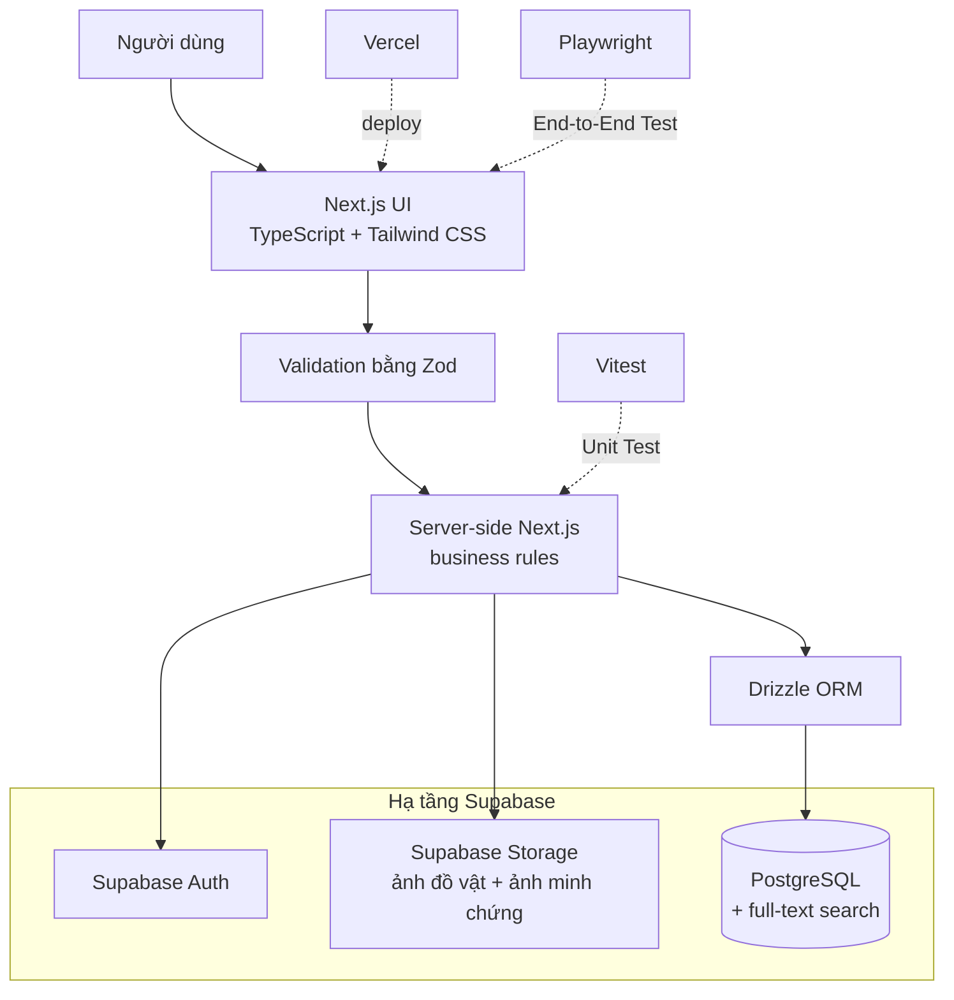

# Phát triển

## 1. Technology Stack

| Thành phần | Công nghệ |
|---|---|
| Frontend | Next.js, TypeScript, Tailwind CSS |
| Backend | Next.js server, Zod, Drizzle ORM, postgres, @supabase/ssr |
| Data storage/Auth | PostgreSQL + Supabase, Supabase Auth |
| File storage | Supabase Storage: bucket công khai `report-images` (ảnh tin), bucket riêng tư `claim-images` (ảnh minh chứng yêu cầu nhận) |
| Tìm kiếm | PostgreSQL full-text search (có sẵn), kết hợp so khớp không dấu bằng `translate()` |
| Testing | Vitest, Playwright |
| Deployment | Vercel |

### Bổ sung stack cho thiết kế

| Nhu cầu trong thiết kế | Giải pháp |
|---|---|
| Đăng 1–5 ảnh mỗi tin | Supabase Storage, cùng nền tảng nên không thêm dịch vụ |
| Ảnh minh chứng khi gửi yêu cầu nhận (nhạy cảm) | Bucket riêng tư `claim-images`, signed URL ngắn hạn tạo ở server; không dùng bucket công khai |
| Popup đăng nhập/đăng ký/quên mật khẩu và Trợ giúp | Thẻ `<dialog>` gốc của trình duyệt, trạng thái trên URL; không thêm thư viện UI |
| Chỉ email trường mới đăng nhập được | Supabase Auth không tự giới hạn tên miền; server kiểm tra danh sách tên miền hợp lệ sau khi đăng ký/đăng nhập |
| Thông báo qua email | MVP chỉ thông báo trong web. Email để sau, khi cần thì thêm dịch vụ như Resend |
| Tin hết hạn sau 60 ngày, yêu cầu hết hạn sau 7 ngày | Không cần tác vụ nền: khi truy vấn, coi bản ghi quá hạn là hết hạn (so `expires_at` với thời điểm hiện tại) |
| Tìm kiếm từ khóa | Tìm kiếm văn bản có sẵn của PostgreSQL, không thêm công cụ |
| Tìm không dấu ("vi" ra "ví") | Điều kiện `translate(...) ilike` trên tiêu đề và mô tả, kết hợp bằng `or` với full-text; hàm bỏ dấu phía server có unit test |

### Sơ đồ tổng thể



Next.js chứa UI và phần server cần thiết trong cùng project. Zod kiểm tra dữ liệu đi vào; business rule và Authorization vẫn do server thực hiện. Drizzle là lớp truy cập PostgreSQL, còn Supabase cung cấp PostgreSQL được host, Authentication và Storage cho ảnh.

### Next.js

**Vai trò trong UniFound:** cung cấp giao diện web và phần server-side/backend cần thiết trong cùng một project; có thể dùng routing, server-side logic và API hoặc Server Actions tùy cách tổ chức khi triển khai.

**Vì sao chọn**

- Phù hợp với MVP nhỏ có khoảng năm màn hình và một số luồng server.
- Giảm số project, cấu hình và deployment mà nhóm phải quản lý.
- Giữ UI và server logic gần nhau trong khi vẫn tách rõ business rule phía server.

**Nếu không dùng:** nhóm có thể tách React frontend và Node.js/Express backend thành hai ứng dụng, nhưng phải tự cấu hình giao tiếp, chạy local và deploy cho cả hai. Next.js không thay PostgreSQL, Drizzle hoặc Supabase Auth.

### TypeScript

**Vai trò trong UniFound:** bổ sung kiểm tra kiểu dữ liệu cho JavaScript. Các kiểu như `Report`, `Claim`, `User` và `Status` giúp dữ liệu nhất quán hơn giữa UI, validation, server và database.

**Vì sao chọn**

- Phát hiện sớm lỗi truyền sai field hoặc sai kiểu dữ liệu khi phát triển theo nhóm.
- Hỗ trợ đổi cấu trúc dữ liệu có kiểm soát hơn vì nơi dùng kiểu bị ảnh hưởng có thể được tìm thấy khi build.
- Kết hợp với Zod và Drizzle để giảm chênh lệch giữa dữ liệu runtime, code và schema.

**Nếu không dùng:** JavaScript vẫn hoạt động, nhưng nhóm phải dựa nhiều hơn vào runtime validation, convention và kiểm thử để phát hiện lỗi kiểu dữ liệu.

### Tailwind CSS

**Vai trò trong UniFound:** cung cấp utility class để xây styling cho feed, form, trạng thái và responsive layout trực tiếp trong component.

**Vì sao chọn**

- Giúp tạo và chỉnh UI nhanh trong thời gian MVP ngắn.
- Dễ giữ spacing, breakpoint và style nhất quán khi nhóm thống nhất convention.
- Hạn chế phải đặt tên và quản lý nhiều CSS selector dùng riêng cho từng component.

**Nếu không dùng:** nhóm vẫn có thể dùng CSS, CSS Modules hoặc framework CSS khác, nhưng phải tự tổ chức style và quy ước nhất quán nhiều hơn. Tailwind không thay thế kiến thức CSS.

### Zod

**Vai trò trong UniFound:** thư viện Validation, tức kiểm tra dữ liệu đầu vào; không phải database hoặc Authentication. Schema Zod có thể kiểm tra `title` không rỗng, `type` chỉ là `LOST` hoặc `FOUND`, thời điểm xảy ra đúng định dạng, số ảnh trong khoảng 1–5, email thuộc tên miền trường hợp lệ và category/location thuộc danh sách hợp lệ (mô hình dữ liệu xem [02_requirements_design.md](02_requirements_design.md#9-mô-hình-dữ-liệu-erd)). Validation quan trọng phải chạy phía server, không chỉ ở frontend.

**Vì sao chọn**

- Gom rule về hình dạng và định dạng input vào schema có thể tái sử dụng.
- Trả lỗi có cấu trúc cho form và request.
- Phù hợp với TypeScript nhưng vẫn kiểm tra được dữ liệu thật tại runtime.

**Nếu không dùng:** nhóm phải tự viết và duy trì các nhánh như “title rỗng → lỗi”, “type không hợp lệ → lỗi”, “date sai → lỗi” cho nhiều request.

Zod kiểm tra dữ liệu tại ranh giới ứng dụng và giúp trả lỗi sớm; constraint của PostgreSQL bảo vệ tính toàn vẹn khi dữ liệu được ghi. Hai lớp bổ sung cho nhau, không thay thế nhau.

### PostgreSQL

**Vai trò trong UniFound:** hệ quản trị cơ sở dữ liệu quan hệ và là nguồn dữ liệu nghiệp vụ chính, lưu School, User/profile, Report, Report image, Match, Claim, Notification, Flag, Category, Location, trạng thái và các quan hệ cần thiết (ERD đầy đủ ở [02_requirements_design.md](02_requirements_design.md#9-mô-hình-dữ-liệu-erd)).

```text
School 1 ── N User
User   1 ── N Report
Report 1 ── N Report image
Report 1 ── N Claim
User   1 ── N Claim
Report 1 ── N Match (tin mất / tin nhặt)
User   1 ── N Notification
Report 1 ── N Flag
```

PostgreSQL cũng cung cấp full-text search để tìm từ khóa trong tiêu đề và mô tả, nên không cần thêm công cụ tìm kiếm riêng.

**Vì sao chọn**

- Mô hình quan hệ phù hợp trực tiếp với ownership và luồng claim của UniFound.
- Primary Key, Foreign Key, `UNIQUE`, `NOT NULL` và `CHECK` giúp bảo vệ tính hợp lệ của dữ liệu.
- `JOIN` hỗ trợ lấy report cùng owner/claim; Transaction giữ nhiều thay đổi trạng thái nhất quán.
- Referential integrity ngăn quan hệ mồ côi hoặc tham chiếu không hợp lệ.

**Nếu không dùng:** nhóm phải chọn database khác hoặc tự quản lý cách lưu, truy vấn, quan hệ và tính toàn vẹn dữ liệu.

`localStorage` chỉ là kho key-value trong từng browser: không tự hiểu PK/FK, quan hệ bảng, `JOIN`, Transaction hoặc constraint, và không phải nguồn dữ liệu dùng chung giữa nhiều người dùng. Dùng nó thay database buộc nhóm tự viết nhiều rule bằng JavaScript nhưng dữ liệu vẫn chủ yếu nằm riêng trên từng browser. Mock data là dữ liệu giả phục vụ phát triển/demo; nó không đồng nghĩa với `localStorage`.

### Supabase

**Vai trò trong UniFound:** cung cấp PostgreSQL được host, Supabase Auth, Supabase Storage (1–5 ảnh mỗi tin trong bucket công khai, bảng `report_images` giữ đường dẫn; tối đa 3 ảnh minh chứng mỗi yêu cầu nhận trong bucket riêng tư, bảng `claim_images` giữ đường dẫn) và hạ tầng hỗ trợ cần thiết. PostgreSQL vẫn là database cốt lõi; Supabase không phải ORM và không thay business logic phía server.

**Vì sao chọn**

- Nhóm không phải tự vận hành máy chủ PostgreSQL cho MVP.
- Database, Authentication và file storage có thể dùng trong cùng một hạ tầng quản lý, không thêm dịch vụ cho ảnh.
- Phù hợp với nhu cầu demo có dữ liệu dùng chung và tài khoản thật của ứng dụng.

**Nếu không dùng:** nhóm phải chọn dịch vụ PostgreSQL/Auth khác hoặc tự host và vận hành các phần tương ứng.

### Drizzle ORM

**Vai trò trong UniFound:** ORM (Object-Relational Mapping) là lớp giúp code TypeScript làm việc với dữ liệu quan hệ. Drizzle chỉ được dùng ở server-side để định nghĩa schema bằng code, tạo Migration, viết query type-safe và giảm map thủ công giữa kết quả SQL với TypeScript. Migration là thay đổi có phiên bản dùng để đưa schema database từ trạng thái này sang trạng thái khác (quy trình thực tế ở mục 6).

**Vì sao chọn**

- Schema và query có type checking cùng code TypeScript.
- Theo dõi thay đổi schema bằng Migration thay vì sửa database thủ công không có lịch sử.
- Giảm lỗi do tên cột hoặc kiểu dữ liệu giữa code và SQL không khớp.

**Nếu không dùng:** nhóm vẫn có thể dùng PostgreSQL driver và viết trực tiếp `SELECT`, `INSERT`, `UPDATE`, `DELETE`; đây là cách hợp lệ nhưng cần tự quản lý SQL, Migration và mapping dữ liệu nhiều hơn. Drizzle là lớp làm việc với PostgreSQL, không phải database.

### Supabase Auth

**Vai trò trong UniFound:** xử lý Authentication (xác thực người dùng là ai): đăng ký, đăng nhập, đăng xuất, session và xác định user hiện tại. Supabase Auth không tự giới hạn theo tên miền, nên server UniFound kiểm tra email có thuộc danh sách tên miền trường hợp lệ hay không sau khi đăng ký/đăng nhập và từ chối nếu không.

```text
Authentication = Người dùng là ai?
Authorization  = Người đó được phép làm gì?
```

Authorization (phân quyền thao tác) vẫn do server UniFound kiểm tra: chỉ chủ tin Nhặt được (`FOUND`) được chấp nhận yêu cầu nhận đồ, người dùng không được sửa tin của người khác và không được gửi yêu cầu vào tin của chính mình (quy tắc đầy đủ ở [02_requirements_design.md](02_requirements_design.md#2-yêu-cầu-chức-năng)).

**Vì sao chọn**

- Cung cấp luồng tài khoản và session cần thiết mà MVP không phải tự xây từ đầu.
- Tích hợp phù hợp với PostgreSQL/Supabase đã chọn.
- Cho server một danh tính đã xác thực để áp dụng ownership và business rule.

**Nếu không dùng:** nhóm phải tự xây hoặc chọn dịch vụ khác cho lưu tài khoản, password hashing, login, session/token, logout, reset password hoặc flow tương đương và bảo vệ endpoint. Supabase Auth không tự quyết định Authorization nghiệp vụ.

### Vercel

**Vai trò trong UniFound:** target deploy cho ứng dụng Next.js và cung cấp URL demo (cấu hình cụ thể ở mục 8).

**Vì sao chọn**

- Giảm cấu hình cần thiết để build và deploy một project Next.js.
- Phù hợp với workflow cập nhật nhanh của MVP và nhu cầu có URL trình diễn.

**Nếu không dùng:** nhóm phải chọn nền tảng hosting khác và tự cấu hình build, environment variables, runtime và domain/URL tương ứng.

### Vitest và Playwright

**Vai trò trong UniFound:** Vitest là test runner cho Unit Test (function/module nhỏ, độc lập: matching score, validation helper, state transition, business rule deterministic). Playwright dùng cho End-to-End Test (luồng người dùng trên ứng dụng hoàn chỉnh qua trình duyệt). Phạm vi và lệnh chạy ở mục 7.

**Vì sao chọn**

- Vitest cho phản hồi nhanh với logic thuần TypeScript có input/output rõ, giúp phát hiện regression mà không cần chạy trình duyệt.
- Playwright kiểm tra UI, server, Authentication và database phối hợp đúng trong luồng thật; bắt lỗi routing, form và quyền truy cập mà Unit Test riêng lẻ không thấy.

**Nếu không dùng:** nhóm phải dùng test runner/framework E2E khác hoặc kiểm tra thủ công, dễ bỏ sót regression.

```text
Vitest     → test function/module nhỏ
Playwright → test luồng người dùng trên ứng dụng hoàn chỉnh
```

## 2. Runtime

| Thành phần | Yêu cầu |
|---|---|
| Node.js | Bản LTS mới (dự án phát triển trên Node.js 24) |
| Package manager | npm đi kèm Node.js |

## 3. Main packages

Phiên bản chính xác được xác định bởi `package.json` và `package-lock.json`, không ghi cố định ở đây vì nhiều package dùng `latest`. Mọi thành viên cài bằng `npm ci` để có cùng phiên bản với lockfile.

| Mục đích | Package |
|---|---|
| Application | `next`, `react`, `react-dom`, `typescript` |
| UI | `tailwindcss`, `@tailwindcss/postcss` |
| Validation | `zod` |
| ORM | `drizzle-orm` |
| Supabase/Auth client | `@supabase/supabase-js`, `@supabase/ssr` |
| Unit Test | `vitest` |
| End-to-End Test | `@playwright/test` |
| PostgreSQL driver và công cụ Migration | `drizzle-kit`, `postgres` |

## 4. Environment variables

Giá trị thật không được ghi vào tài liệu hoặc commit.

| Biến | Phạm vi | Mục đích |
|---|---|---|
| `NEXT_PUBLIC_SUPABASE_URL` | Client + server | URL project Supabase |
| `NEXT_PUBLIC_SUPABASE_PUBLISHABLE_KEY` | Client + server | Publishable key cho Supabase client |
| `DATABASE_URL` | Chỉ server | Kết nối PostgreSQL cho Drizzle qua Supabase transaction pooler |
| `ALLOWED_EMAIL_DOMAINS` | Chỉ server | Danh sách tên miền email trường hợp lệ (phân tách bằng dấu phẩy) để server từ chối email ngoài trường |
| `SEED_DEMO_PASSWORD` | Chỉ seed/E2E | Mật khẩu chung của tài khoản demo do seed tạo (≥ 8 ký tự); cần cho `npm run db:seed` và test E2E đăng nhập |

Tên biến phải được xác nhận lại theo cấu hình Supabase thực tế khi triển khai. Không đưa database password hoặc secret server vào biến có tiền tố `NEXT_PUBLIC_`.

## 5. Local development

Mã nguồn ứng dụng đã có đầy đủ luồng chính. Scripts trong `package.json`:

| Thao tác | Lệnh |
|---|---|
| Install | `npm ci` |
| Run development | `npm run dev` |
| Unit Test | `npm test` |
| End-to-End Test | `npm run test:e2e` |
| Lint | `npm run lint` |
| Typecheck | `npm run typecheck` |
| Build | `npm run build` |
| Sinh migration | `npm run db:generate` |
| Chạy migration | `npm run db:migrate` |
| Đồng bộ schema | `npm run db:push` |
| Nạp dữ liệu demo | `npm run db:seed` |

## 6. Database workflow

Schema theo ERD ở [02_requirements_design.md](02_requirements_design.md#9-mô-hình-dữ-liệu-erd) được định nghĩa bằng Drizzle, không sửa trực tiếp trên database.

```text
Drizzle schema (src/db/schema.ts)
      ↓ drizzle-kit generate
Migration có phiên bản (thư mục drizzle/)
      ↓ drizzle-kit migrate (npm run db:migrate)
PostgreSQL trên Supabase
```

- **Schema design:** 11 bảng `schools`, `users`, `categories`, `locations`, `reports`, `report_images`, `matches`, `claims`, `claim_images`, `notifications`, `flags`, với các enum cho `report.type` (`LOST`/`FOUND`), `report.status` (`OPEN`, `IN_PROGRESS`, `RETURNED`, `CLOSED`, `HIDDEN`), `claim.status` (`PENDING`, `ACCEPTED`, `REJECTED`, `COMPLETED`, `EXPIRED`), `match.status` (`SUGGESTED`, `DISMISSED`, `USED`), `user.role` (`USER`/`ADMIN`) và `user.status` (`active`/`locked`).
- **Ràng buộc toàn vẹn dự kiến:** khóa ngoại theo ERD; `UNIQUE(claims.report_id, claims.claimant_id)` để mỗi người chỉ gửi một yêu cầu cho mỗi tin; partial unique index trên `claims(report_id) WHERE status = 'ACCEPTED'` để mỗi tin có tối đa một yêu cầu được chấp nhận; `UNIQUE(matches.lost_report_id, matches.found_report_id)`; `CHECK` giới hạn score 0–100.
- **Tìm kiếm:** full-text search PostgreSQL trên `reports.title` và `reports.description` (ví dụ cột `tsvector` + index GIN).
- **Hết hạn:** `reports.expires_at` = thời điểm tạo + 60 ngày; yêu cầu quá 7 ngày chưa phản hồi coi là `EXPIRED`. Truy vấn lọc theo thời điểm hiện tại, không có tác vụ nền.
- **Lưu ảnh:** file ảnh trong Supabase Storage; `report_images.image_url` giữ đường dẫn. Ảnh minh chứng nằm ở bucket riêng tư `claim-images` (5 MB, JPG/PNG/WEBP) với bảng `claim_images` (`claim_id` xóa theo yêu cầu, bật RLS). Migration `0006` tạo bảng, bucket và policy Storage: mỗi người chỉ tải vào thư mục của mình; đọc/tạo signed URL được với chủ thư mục, người nhặt của tin (qua hàm `security definer public.can_read_claim_image`) hoặc ADMIN. Server tạo signed URL 1 giờ bằng session của người xem, không cần service-role key.
- **Database client:** dùng driver `postgres` với connection pool và `prepare: false` để tương thích transaction pooler.
- **Seed demo data:** dữ liệu mẫu gồm trường, danh mục, địa điểm và một số tin; không chứa thông tin cá nhân thật (PII) hay secret.

## 7. Testing

| Công cụ | Phạm vi chính | Lệnh |
|---|---|---|
| Vitest | Matching score, validation (email tên miền, số ảnh, ảnh minh chứng), tìm không dấu, state transition, kiểm tra hết hạn (78 test) | `npm test` |
| Playwright | Luồng đăng nhập → đăng tin → gửi yêu cầu nhận đồ → chấp nhận → hai bên xác nhận → Đã trả trên ứng dụng hoàn chỉnh; thanh tìm kiếm/lọc; header, popup xác thực, Trợ giúp, footer; gửi yêu cầu kèm ảnh minh chứng và quyền xem ảnh (22 test) | `npm run test:e2e` |

## 8. Deployment

- Target: Vercel.
- Cấu hình environment variables trên môi trường deploy bằng đúng tên ở mục 4; không commit giá trị thật.
- Build command và cấu hình runtime: `npm run build`.
- Production/demo URL: https://unifound-blue.vercel.app/ (do nhóm trưởng deploy 2026-10-02; kiểm thử trên URL này xem `05_testing_deployment.md`).

## 9. Cấu trúc thư mục

```text
unifound/
├── src/
│   ├── app/         # Next.js routes, pages, API routes/Server Actions (màn hình S01–S13)
│   ├── components/  # Component dùng chung (ui, layout: header/menu/popup/trợ giúp/footer, reports, claims, matching, admin)
│   ├── lib/         # Server logic: auth (domain email, ownership), reports, claims, matching, notifications, flags, admin
│   ├── db/          # Drizzle schema, database client, migrate/seed scripts
│   ├── utils/       # Supabase SSR server/client helpers
│   └── proxy.ts     # Refresh session + chặn trang cần đăng nhập (Next.js 16 thay middleware.ts)
├── drizzle/      # Migration SQL có phiên bản được sinh bởi Drizzle Kit
├── tests/e2e/    # Playwright test
├── public/       # static asset
└── docs/         # tài liệu dự án
```

